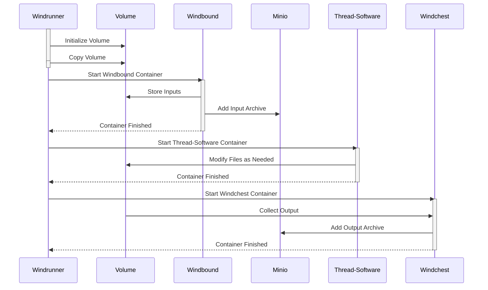

# windrunner
Dispatch Code

## Webhook Sequence.

```mermaid
  sequenceDiagram
    participant Windrunner
    activate Windrunner
      Windrunner->>Volume: Initialize Volume
      Windrunner->>Volume: Copy Volume
    deactivate Windrunner
    activate Windrunner
    deactivate Windrunner
    Windrunner->>Windbound: Start Windbound Container
    activate Windbound
      Windbound->>Volume: Store Inputs
      Windbound->>Minio: Add Input Archive
      Windbound-->>Windrunner: Container Finished
    deactivate Windbound
    Windrunner->>Thread-Software: Start Thread-Software Container
    activate Thread-Software
      Thread-Software->>Volume: Modify Files as Needed
      Thread-Software-->>Windrunner: Container Finished
    deactivate Thread-Software
    Windrunner->>Windchest: Start Windchest Container
    activate Windchest
      Volume->>Windchest: Collect Output
      Windchest->>Minio: Add Output Archive
      Windchest-->>Windrunner: Container Finished
    deactivate Windchest
```
